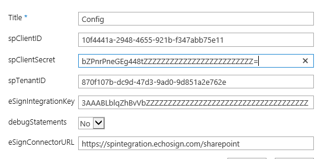

#Install WSP on the site collection

- Get the latest supported WSP

- Upload WSP package to Solution Gallery which is located at the top of each the **site collection > Site Settings > Web Designer Galleries > Solutions**.  
    
	

- Activate the upload solution

- Activate site feature manually, go to **Site Settings > Site Features > Adobe eSign Workflow Actions > Activate".  Do the same for Adobe eSign Workflows Config List.

    
    
  
#eSignConfig List

###How to populate the list:
  - Example of filled out item:
  
	
  
  - create a new item with Title = "Config"
  
  - spTenantID: - go to **Site Settings > Site App Permissions**.   For Workflow Entry copy the part after @    i:0i.t|ms.sp.ext|d559ac84-d8e6-4515-9229-8966b4554601@**870f107b-dc9d-47d3-9ad0-9d851a2e762e**    
  
  - spClientID and spClientSecret:
    - append the following URL after site **_layouts/15/appregnew.aspx** and generate id and secret using Register page.   This puts a new service principal in Azure AD.  You can reuse the same principal across site collections:
    
    
    - Grant the new service principal permissions to the site by going to **_layouts/15/appinv.aspx**.  This has to be done on every site where workflows will run.
      
      - Note: The app will elevate the user to run with app permissions (Full control in example below.   You can reduce the permission grant to allow full control of a site or lesser level):
      
        ```XML	   
      	<AppPermissionRequests AllowAppOnlyPolicy="true">
            <AppPermissionRequest Scope="http://sharepoint/content/sitecollection" Right="FullControl" />
          </AppPermissionRequests>
        ```
      - Trust the app:
         
      - You should see a result in **Site Settings > Site App Permissions**
        
		
    
	- eSignIntegrationKey - generate in Adobe Sign admin.
	
		- Go to Account > Adobe Sign API > API Information
         
		 
		- Create a new key with specific permissions:
		
		 
		
		- Get the key value by clickin on the link
		
		
		
	- eSignConnectorURL  -  https://spintegration.echosign.com/sharepoint
    
    
##Security considerations for reading eSignConfig list from workflow action:

It is best practice to only allow site collection administrators access to eSignConfig list.

If the workflow is started by the user who has access to eSignConfig list, then the workflow will run without problems.   However, if the user does not have access to the list, then the worklfow actions need to be wrapped into app step.

- On the site where the workflow is published, go to **Site Settings > Site Features** and activate **Workflows can use app permissions** feature.
- Get the id of the workflow service principal by going to **Site Settings > Site App Permissions** 
	- Example: Workflow	i:0i.t|ms.sp.ext|**d559ac84-d8e6-4515-9229-8966b4554601**@870f107b-dc9d-47d3-9ad0-9d851a2e762e
- Give the workflow service principal permissions in **_layouts/15/appinv.aspx** similar to what we did with actual app.
      	

- Trust the Workflow service principal
- Now the app step should be available in SharePoint Designer (restart is required):

	
 

- 


      


  
  - 
  
    
