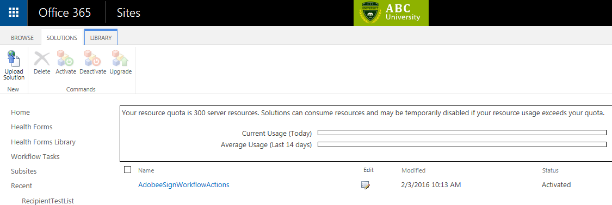

- Upload WSP package to Solution Gallery which is located at the top of each the **site collection > Site Settings > Web Designer Galleries > Solutions**.  
    
	
- Activate site feature manually, go to **Site Settings > Site Features > Adobe eSign Workflow Actions > Activate"
    
    
  
  - 
  
    
