##Action: Send Agreement With Parameters

Sentence: Send Agreement with library id: %1 (leave empty to send document) name: %2 message: %3 sender %4 recipient email %5 role: %6 flow: %7, type: %8 output AgreementID to %9: error message: %10 code: %11

| Paramater            | Type  | ID | Notes |
| :------------------- |:----- | :--|:------|
| LibraryDocumentId    | In    | 1  |Leave this empty or use a library id from eSign account. See below.|
| AgreementName        | In    | 2  |If using CurrentItem:Title, make sure that Title is not empty|
| AgreementMessage     | In    | 3  ||
| AgreementSender      | In    | 4  |Needs to be an email addres that's part of the eSign account|
| RecipientEmail(s)    | In    | 5  |See below|
| RecipientRole        | In    | 6  ||
| SignatureFlow        | In    | 7  ||
| SignatureType        | In    | 8  ||
| MergeFieldInfo       | In    | 9  |Dictionary key=mergefieldName value=mergefieldValue, converted to string for sending to connector app. See below.|
| AgreementID          | Out   | 10 ||
| ErrorMessage         | Out   | 11 ||
| ErrorCode            | Out   | 12 ||

**LibraryDocumentId:**

- For custom list workflow LibraryDocumentId is required.   Currently, to get the id use get-library-document-ids page which queries eSign API.
- For document library workflow if value is left empty, then the workflow will upload the current document as a transient document in eSign.

**MergeFieldInfo:**

- use SharePoint Designer Dictionary to pass merge fields information to send agreement. 

 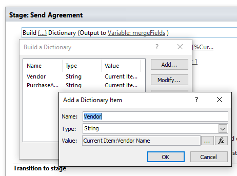
 
- the document must have the following tags to match:

 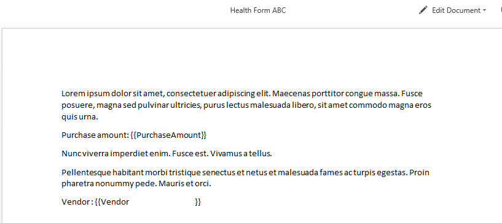

 
**Format for recipientEmail(s) and how a workflow designer would enter:**
- this is what SharePoint entry looks like.  Signers is multi value Person column.  Signer 1, Signer 2 are single value Person columns.

  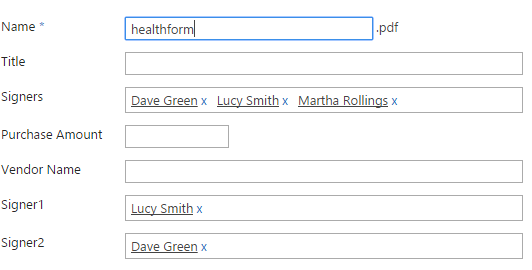
 
- multiple recipients simple case:    **a@b.com;b@c.com;**
  - all recipients have the same role passed in as recipientRole specified in Designer
  - this is how it looks like from SharePoint Designer:
  
    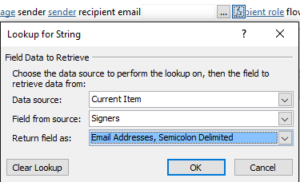
  
  - build the JSON to pass to EchoSign
- multiple recipients complex case:    **a@b.com:SIGNER,b@c.com:APPROVER**
  - This is how building looks like from SharePoint Designer:
  
    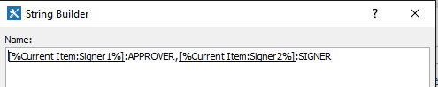
  
  - build the JSON to pass to EchoSign
- single recipient:    **a@b.com**
  - build the JSON to pass to EchoSign

Examples of complete send agreement actions:

- for document library
 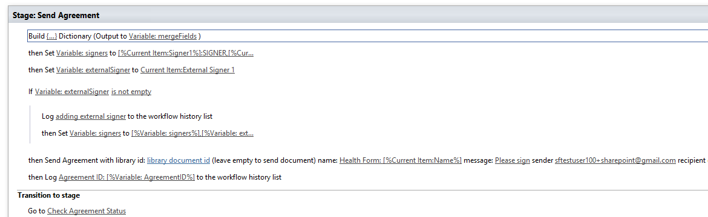

- for custom list
 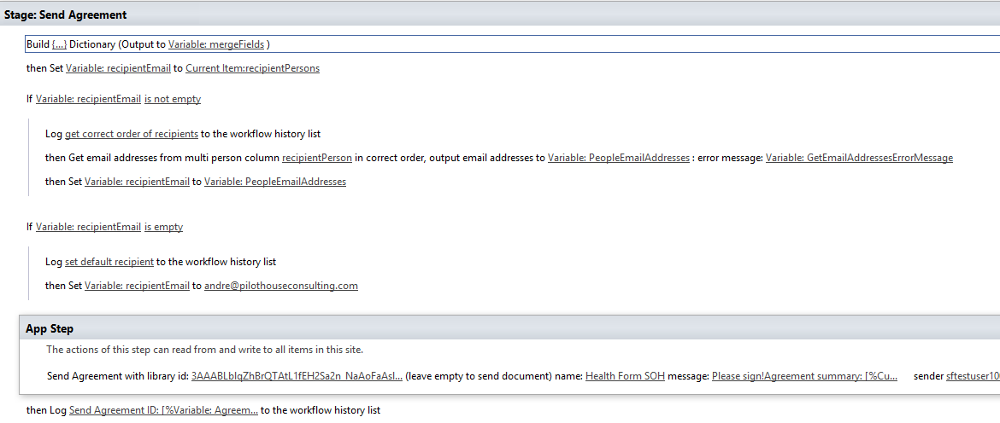
  

##Action: Get Agreement Status

Sentence: Get Agreement Status for Agreement ID %1, sender: %2 output Status to %3

| Paramater            | Type  | ID |
| :------------------- |:----- | :--|
| AgreementID          | In    | 1  |
| AgreementSender      | In    | 2  |
| AgreementStatus      | Out   | 3  |

Below is an example of how to check status until SIGNED using SharePoint 2013 Designer workflow:

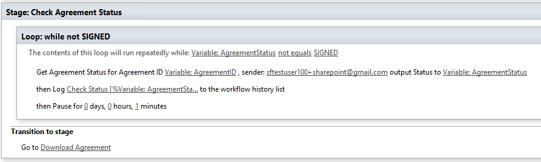
  
##Action: Download Agreement

Sentence: Download Agreement with Agreement ID %1 %2 with file name: %3: sender: %4 attach audit report: %5, attach supporting documents: %6 result status: %7 error status: %8 code: %9

| Paramater                 | Type  | ID |
| :------------------------ |:----- | :--|
| AgreementID               | In    | 1  |
| SaveType                  | In    | 2  |
| AgreementFileName         | In    | 3  |
| AgreementSender           | In    | 4  |
| AttachAuditReport         | In    | 5  |
| AttachSupportingDocuments | In    | 6  |
| DownloadActionResult      | Out   | 7  |
| DownloadErrorMessage      | Out   | 8  |
| DownloadErrorCode         | Out   | 9  |

Example of Download Agreement in SharePoint Designer
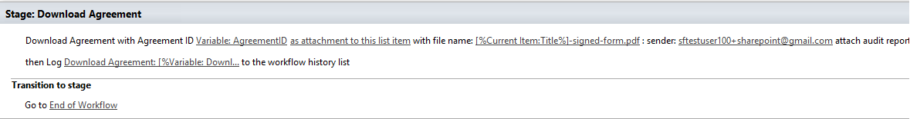

Result of the action in a list:

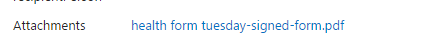

Result of the action in a document library

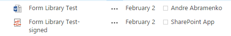

__Important__:  If downloading into a library that has required check out or required columns, make sure to have a document checked in after the document is in SharePoint.   Otherwise the document will have no checked in version and will not be visible to all readers.

##Action: Cancel Agreement

Sentence: Cancel Agreement with Agreement ID %1, sender: %2 cancel comment: %3 notify sender: %4 output Cancel Status to %5 

| Paramater            | Type  | ID |
| :------------------- |:----- | :--|
| AgreementID          | In    | 1  |
| AgreementSender      | In    | 2  |
| Comment              | In    | 3  |
| NotifySigner         | In    | 4  |
| AgreementCancelStatus| Out   | 5  |

##Action: Get Email Addresses From Multi Person Column In Correct Order

Sentence: Get email addresses from multi person column %1 in correct order, output email addresses to %2: error message: %3

| Paramater            | Type  | ID |Notes  |
| :------------------- |:----- | :--|:------|
| PeopleColumnName     | In    | 1  | Internal name of the SharePoint column (not display name). Example: Agrement_x0020_Signers |
| PeopleEmailAddresses      | Out    | 2  | Emails addresses semicolon delimited in correct order based on ids in PeopleColumnName |
| GetEmailAddressesErrorMessage| Out   | 3 ||

